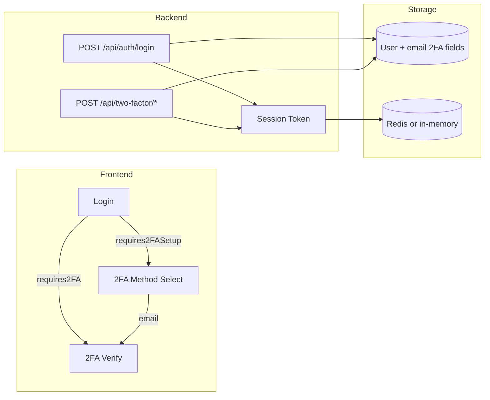

# Technical Document: Two-Factor Authentication (2FA) via Email

This document describes how two-factor authentication (2FA) via email was implemented in the Invoice Portal. It covers backend APIs, session tokens, database schema, frontend flows, and security measures so the same approach can be replicated in another project.

---

## 1. Architecture Overview



- **2FA methods**: Authenticator (TOTP) and **email** (6-digit code sent to user email).
- **Session token**: Short-lived token issued after password check so the frontend never sends the password to 2FA routes; used for setup and resend.
- **Email code**: 6-digit numeric code, 10-minute expiry, stored on the user record; rate-limited (e.g. 1 per 60s per user for email sends).

---

## 2. Backend Implementation

### 2.1 Database (User model)

**File:** `backend/models/User.js`

Add or ensure these columns:

| Column                  | Type                           | Purpose                                          |
| ----------------------- | ------------------------------ | ------------------------------------------------ |
| `twoFactorSecret`       | STRING, nullable               | TOTP secret (authenticator); null for email-only |
| `twoFactorEnabled`      | BOOLEAN, default false         | 2FA turned on                                    |
| `twoFactorVerified`     | BOOLEAN, default false         | User completed setup (entered code once)         |
| `twoFactorMethod`       | ENUM('authenticator', 'email') | Chosen method                                    |
| `emailTwoFactorCode`    | STRING(6), nullable            | Current 6-digit code (plain text; single-use)    |
| `emailTwoFactorExpires` | DATE, nullable                 | Code expiry (e.g. now + 10 min)                 |

**Security:** Never expose `twoFactorSecret`, `emailTwoFactorCode`, or `emailTwoFactorExpires` in API responses. Use `toSafeObject()` (or equivalent) to strip them.

**Migration:** If adding columns later, use a migration or script similar to `backend/scripts/add-email-2fa-columns.js` (add `twoFactorMethod`, `emailTwoFactorCode`, `emailTwoFactorExpires`).

### 2.2 Global 2FA settings (Settings model)

**File:** `backend/models/Settings.js`

Store a JSON/JSONB field, e.g. `twoFactorAuth`:

```js
twoFactorAuth: {
  enabled: false,
  required: false,
  issuer: 'Your App Name',
  allowedMethods: ['authenticator', 'email']
}
```

- **enabled**: 2FA feature on/off.
- **required**: If true, users without 2FA set up are forced to complete setup after login.
- **allowedMethods**: Which methods are available; include `'email'` for email 2FA.

### 2.3 Session token (avoid passing password to 2FA)

**File:** `backend/utils/sessionToken.js`

- **generateSessionToken(userId, email)**
  - Create a random token (e.g. `crypto.randomBytes(32).toString('hex')`).
  - Store `{ userId, email, expiresAt }` with TTL (e.g. 10 minutes).
  - Prefer Redis (`SETEX`); fallback to in-memory Map.
  - Return the token string.
- **verifySessionToken(token, consume)**
  - Look up token; if missing or expired return null.
  - If `consume === true`, delete the token (one-time use for verify-setup).
  - Return `{ userId, email }`.

Use session tokens so 2FA setup and "resend code" can be authorized without sending the password again.

### 2.4 Login flow and when to send email code

**File:** `backend/routes/auth.js`

After validating email/password and checking account active:

1. **Load 2FA settings**
   - `requires2FA = settings.twoFactorAuth.enabled && settings.twoFactorAuth.required`
   - `allowedMethods = settings.twoFactorAuth.allowedMethods || ['authenticator','email']`
2. **If 2FA required and user has no 2FA or not verified**
   - Generate session token.
   - Return `200` with `requires2FASetup: true`, `sessionToken`, `allowedMethods`, `user` (safe).
   - Frontend redirects to method selection.
3. **If 2FA required and user has 2FA enabled but no `twoFactorCode` in body**
   - Generate session token.
   - If `user.twoFactorMethod === 'email'`:
     - Generate 6-digit code: `crypto.randomInt(100000, 999999).toString()`.
     - Set `expiresAt = now + 10 * 60 * 1000`.
     - Save `user.emailTwoFactorCode`, `user.emailTwoFactorExpires` and `user.save()`.
     - Send email via templated email (see below) with retries (e.g. 2 attempts, 1s delay).
   - Return `200` with `requires2FA: true`, `sessionToken`, `twoFactorMethod`, `user` (with masked email), and optionally `emailSendFailed` if send failed.
4. **If 2FA required and user sent `twoFactorCode`**
   - **Email method:**
     - Ensure `user.emailTwoFactorCode` and `user.emailTwoFactorExpires` exist.
     - Reject if expired.
     - Compare `req.body.twoFactorCode === user.emailTwoFactorCode` (constant-time in production).
     - On success: set `user.emailTwoFactorCode = null`, `user.emailTwoFactorExpires = null`, save.
   - **Authenticator method:**
     - Verify with TOTP (e.g. `speakeasy.totp.verify({ secret, encoding: 'base32', token, window: 2 })`).
   - On failure: `401` "Invalid 2FA code".
   - On success: update last login, issue JWT, return token and safe user (no password, no 2FA secret, no email code).

### 2.5 Two-factor routes (setup and resend)

**File:** `backend/routes/twoFactor.js`

Mount under something like `app.use('/api/two-factor', twoFactorRouter)` (e.g. in `backend/server.js`).

**Email code generation and rate limit (in-memory or Redis):**

- `generateEmailCode()`: `crypto.randomInt(100000, 999999).toString()`.
- Per-user rate limit: e.g. 1 email per 60 seconds; return `429` with `waitSeconds` if exceeded.

**Endpoints:**

| Method | Path               | Auth                               | Purpose                                                                                                                                   |
| ------ | ------------------ | ---------------------------------- | ----------------------------------------------------------------------------------------------------------------------------------------- |
| POST   | `/setup`           | sessionToken or JWT                | Generate TOTP secret + QR (authenticator setup).                                                                                          |
| POST   | `/verify-setup`    | sessionToken (consumed) or JWT      | Verify setup code (TOTP or email); set `twoFactorEnabled`, `twoFactorVerified`, `twoFactorMethod`; clear email code if email; return JWT. |
| POST   | `/setup-email`    | sessionToken or JWT                | Set `twoFactorMethod = 'email'`, generate code, save expiry, rate-limit, send email; return masked email.                                |
| POST   | `/send-email-code`| sessionToken or email (for resend) | Ensure user has `twoFactorMethod === 'email'`; rate-limit; new code + expiry; save; send email.                                           |
| POST   | `/verify-login`   | (email + token in body)            | Optional alternative login 2FA step; verify email code or TOTP; return success.                                                          |
| DELETE | `/:userId`        | JWT, admin/manager                 | Remove 2FA for user (clear secret, method, email code, flags).                                                                            |

**Resend flow:**
`POST /api/two-factor/send-email-code` body: `{ sessionToken }` or `{ email }`. Resolve user from session token or by email; enforce rate limit; generate new code, save, send same template.

### 2.6 Email template

**File:** `backend/templates/emails/two-factor-code.html`

- **Template name:** `'two-factor-code'`.
- **Variables:**
  - `userName`, `verificationCode` (6 digits), `expiryMinutes` (e.g. `'10'`).
  - Branding: `companyName`, `logoUrl`, `portalUrl`, `primaryColor`, `currentYear` (from your existing template system).
- **Subject:** e.g. "Your verification code - {{companyName}}".
- **Preheader:** "Your verification code is {{verificationCode}}. It expires in {{expiryMinutes}} minutes."

**Sending:** Use a single `sendTemplatedEmail(templateName, to, data, settings, requestContext)` helper. Example call:

```js
await sendTemplatedEmail(
  'two-factor-code',
  user.email,
  { userName: user.name, verificationCode: code, expiryMinutes: '10' },
  emailSettings,
  { context: { type: '2fa-login', userId: user.id } }
);
```

Use the same template and variables for both "2FA setup" and "2FA login" (different `context.type` if you need logging).

### 2.7 Rate limiting

- **Email 2FA send:** In `backend/routes/twoFactor.js`, per-user limit (e.g. 1 per 60s) before generating/sending code; return 429 and `waitSeconds` when exceeded.
- **2FA verification attempts:** Optional global rate limiter (e.g. 10 attempts per 5 minutes per IP/email) on login or two-factor routes (e.g. `backend/middleware/rateLimiter.js` `twoFactor` limiter).

### 2.8 Admin: remove 2FA

**File:** `backend/routes/users.js` — `DELETE /api/users/:id/two-factor`

- Require JWT and role (e.g. global_admin, administrator, manager).
- Set `twoFactorSecret`, `twoFactorEnabled`, `twoFactorVerified`, `twoFactorMethod`, `emailTwoFactorCode`, `emailTwoFactorExpires` to null/false; save.
- Log activity (e.g. TWO_FACTOR_REMOVED).

---

## 3. Frontend Implementation

### 3.1 Auth context and login response handling

**File:** `frontend/src/context/AuthContext.js`

- `login(email, password, recaptchaToken)` calls `POST /api/auth/login` with `{ email, password, recaptchaToken }`.
- Do **not** store password in context; only use it for the second login request when submitting 2FA.
- Handle response:
  - **requires2FASetup: true** → return `{ success: false, requires2FASetup: true, user, sessionToken, allowedMethods, message }`.
  - **requires2FA: true** → return `{ success: false, requires2FA: true, user, sessionToken, twoFactorMethod, emailSendFailed, message }`.
  - Otherwise store token and user and return `{ success: true }`.

### 3.2 Login page → redirect to 2FA

**File:** `frontend/src/pages/Login.js`

After `login()`:

- If `result.requires2FASetup`:
  - `navigate('/two-factor-method-select', { state: { user, sessionToken, allowedMethods, from: redirectPath } })`.
- If `result.requires2FA`:
  - `navigate('/two-factor-verify', { state: { user, sessionToken, password, twoFactorMethod, maskedEmail, emailSendFailed, from: redirectPath } })`.

**Security:** Pass `password` only in `location.state` for the 2FA verify step; it is sent once more in the final `POST /api/auth/login` with `twoFactorCode`. Do not persist password in storage.

### 3.3 2FA method selection

**File:** `frontend/src/pages/TwoFactorMethodSelect.js`

- Rendered when user must choose 2FA method (first-time setup).
- Reads `location.state`: `sessionToken`, `allowedMethods`, `user`, `from`.
- **Authenticator:** Navigate to `/2fa-setup` (or `/two-factor-setup`) with `state: { sessionToken, user, from }`.
- **Email:**
  - Call `POST /api/two-factor/setup-email` with `{ sessionToken }` (or nothing if using JWT from profile).
  - On success, navigate to `/2fa-verify` (or `/two-factor-verify`) with `state: { sessionToken, user, twoFactorMethod: 'email', maskedEmail, from, isSetup: true }`.

### 3.4 2FA verify page (setup and login)

**File:** `frontend/src/pages/TwoFactorVerify.js`

- **State from location:** `user`, `twoFactorMethod`, `maskedEmail`, `sessionToken`, `isSetup`, `from`, `emailSendFailed`, and for login flow `password`.
- **Setup flow (`isSetup === true`):**
  - Submit: `POST /api/two-factor/verify-setup` with `{ token: verificationCode, method: twoFactorMethod, sessionToken }` (sessionToken optional if JWT).
  - On success: backend returns JWT and user; store token and user, refresh auth context, navigate to `from` or `/`.
- **Login flow (`isSetup === false`):**
  - Submit: `POST /api/auth/login` with `{ email: userData.email, password: location.state.password, twoFactorCode: verificationCode }`.
  - On success: store token and user, then navigate (e.g. `window.location.href = from` to refresh auth).
- **Resend (email only):**
  - `POST /api/two-factor/send-email-code` with `{ sessionToken }` or `{ email: userData.email }`.
  - Show 60s cooldown and "Resend code in Xs" to match backend rate limit.
- **UX:** If `emailSendFailed` from login, show message and "Resend" so user can request code again.

### 3.5 Routes

**File:** `frontend/src/App.js`

Register routes (no auth required for these):

- `/two-factor-method-select` or `/2fa-method-select` → TwoFactorMethodSelect
- `/two-factor-verify` or `/2fa-verify` → TwoFactorVerify
- `/two-factor-setup` or `/2fa-setup` → TwoFactorSetup (authenticator)

Ensure auth redirect logic does not treat these paths as "already logged in" (e.g. exclude them from redirecting to dashboard).

### 3.6 API client

**File:** `frontend/src/services/api.js`

- Do not send Bearer token for `/login`, `/two-factor/*`, `/forgot-password`, etc. (or allow 401 on these so user can complete 2FA).
- Include `/two-factor` in the list of auth-related paths that are not forced to require a valid JWT when making requests.

---

## 4. Security Checklist

- **Session token:** Short TTL (10 min), single-use on verify-setup; store in Redis or secure server memory.
- **Email code:** 6 digits, 10-minute expiry; clear immediately after successful verification (and on failure after a short delay if you want to prevent brute force; rate limiting is essential).
- **Rate limits:** Per-user for sending email codes (e.g. 1/60s); optional per-IP or per-email for 2FA verification attempts.
- **Responses:** Never return `twoFactorSecret`, `emailTwoFactorCode`, or `emailTwoFactorExpires` in JSON; use a safe user serializer.
- **Password:** Only sent over HTTPS to login; passed via React state to 2FA verify page and sent once more with `twoFactorCode`; never stored in localStorage/sessionStorage.
- **reCAPTCHA:** Applied on login route; when `twoFactorCode` is present, recaptcha middleware may skip or relax to avoid blocking 2FA step (e.g. `backend/middleware/recaptcha.js`).

---

## 5. File Reference Summary

| Area                                                           | Files                                                                                          |
| -------------------------------------------------------------- | ---------------------------------------------------------------------------------------------- |
| Backend auth + email send on login                             | `backend/routes/auth.js`                                                                       |
| 2FA routes (setup, verify-setup, setup-email, send-email-code)| `backend/routes/twoFactor.js`                                                                  |
| Session token                                                  | `backend/utils/sessionToken.js`                                                                |
| User model (2FA + email code columns)                          | `backend/models/User.js`                                                                       |
| Settings (twoFactorAuth)                                       | `backend/models/Settings.js`                                                                   |
| Email template                                                 | `backend/templates/emails/two-factor-code.html`                                                |
| Send template helper                                           | `backend/utils/sendTemplatedEmail.js`                                                         |
| Frontend login + redirect                                      | `frontend/src/pages/Login.js`                                                                  |
| Auth context                                                   | `frontend/src/context/AuthContext.js`                                                           |
| Method select                                                  | `frontend/src/pages/TwoFactorMethodSelect.js`                                                  |
| Verify (setup + login + resend)                                | `frontend/src/pages/TwoFactorVerify.js`                                                        |
| Routes                                                         | `frontend/src/App.js`                                                                          |
| Admin remove 2FA                                               | `backend/routes/users.js` — `DELETE /:id/two-factor`                                            |

---

## 6. Optional: Profile and user management

- **Profile:** Users can enable 2FA from profile by navigating to the same method-select page with `fromProfile: true` and no session token (JWT in header used for setup-email and verify-setup).
- **User management:** List and show `twoFactorEnabled` (and optionally `twoFactorMethod`); provide "Reset 2FA" that calls `DELETE /api/users/:id/two-factor` for admins/managers.

This document is sufficient to re-implement 2FA via email in another project using the same patterns (session token, single login endpoint with optional `twoFactorCode`, dedicated 2FA routes, and one email template).
